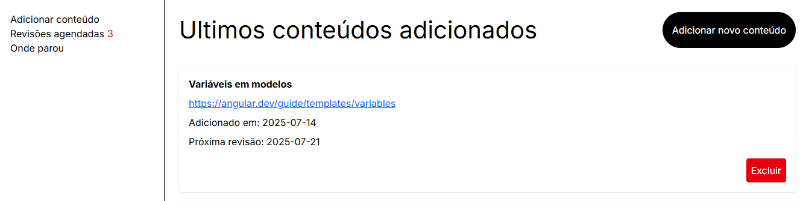
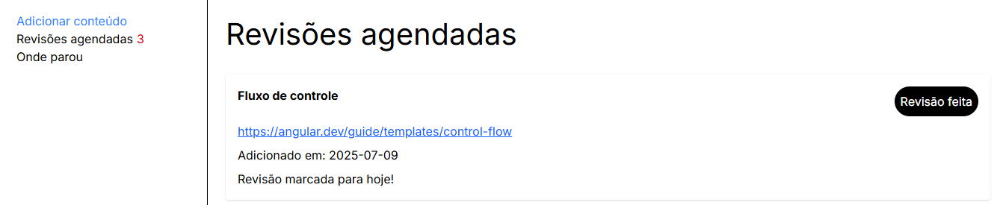

# 📚 Revisa-AI

**Sistema de repetição espaçada para otimizar seus estudos**

O **Revisa-AI** é uma aplicação web desenvolvida para me ajudar nos estudos e fixar melhor o conteúdo através da técnica de **repetição espaçada**. O sistema permite adicionar links de conteúdos e agenda automaticamente revisões em intervalos otimizados: **7, +7 e +14 dias**.

## 🎯 **Por que usar o Revisa-AI?**

- **📅 Repetição Espaçada:** Baseado em estudos científicos, o sistema agenda revisões nos momentos ideais para maximizar a retenção
- **🤖 IA Integrada:** Resumos automáticos gerados pelo Google Gemini (opcional). No código já está pronto a requisição, a única coisa que você precisa passar é sua API KEY. Sinta-se a vontade para comentar o código que faz essa requisição se preferir não usa-la.
- **📱 Interface Intuitiva:** Design moderno e responsivo construído com Angular e Tailwind
- **💾 Dados Locais:** Seus dados ficam seguros em um banco SQLite local
- **🚀 Fácil de Usar:** Basta adicionar um link e o sistema cuida do resto

## ✨ **Funcionalidades**

- ✅ Adicionar conteúdos via link
- ✅ Agendamento automático de revisões (7, +7, +14 dias)
- ✅ Dashboard de revisões do dia
- ✅ Resumos automáticos opcional com IA (Google Gemini)
- ✅ Controle de progresso das revisões
- ✅ Interface responsiva e moderna

## 🛠️ **Tecnologias Utilizadas**

### **Frontend**

- **Angular 19** - Framework principal
- **TypeScript** - Linguagem
- **TailwindCSS** - Estilização
- **Standalone Components** - Arquitetura moderna

### **Backend**

- **Node.js** - Runtime
- **Express.js** - Framework web
- **SQLite** - Banco de dados local
- **Google Gemini API** - IA para resumos (opcional)

## 🚀 **Como usar**

### **1. Clone o repositório**

```bash
git clone https://github.com/carloseduardo22-rjce/revisa-ai.git
cd revisa-ai
```

### **2. Instale as dependências do frontend**

```bash
npm install
```

### **3. Instale as dependências do backend**

```bash
cd server
npm install
```

### **4. Configure a API do Google Gemini (Opcional)**

- Crie um arquivo `.env` na raiz do projeto
- Adicione sua chave da API:

```env
google_ai_key=SUA_CHAVE_AQUI
```

### **5. Execute o projeto**

**Terminal 1 - Backend:**

```bash
cd server
node index.js
```

**Terminal 2 - Frontend:**

```bash
ng serve
```

### **6. Acesse a aplicação**

- Frontend: `http://localhost:4200`
- Backend API: `http://localhost:3000`

## 📁 **Estrutura do Projeto**

```
revisa-ai/
├── src/                    # Frontend Angular
│   ├── app/
│   │   ├── components/     # Componentes da aplicação
│   │   └── ...
├── server/                 # Backend Node.js
│   ├── controllers/        # Lógica dos endpoints
│   ├── routes/            # Definição das rotas
│   ├── models/            # Modelos de dados
│   ├── database/          # Configuração do SQLite
│   └── contents.db        # Banco de dados local
├── package.json           # Dependências do frontend
└── README.md
```

## 📖 **Como funciona a Repetição Espaçada**

1. **Dia 1:** Você adiciona um conteúdo
2. **Dia 8:** Primeira revisão (7 dias depois)
3. **Dia 15:** Segunda revisão (+7 dias da primeira)
4. **Dia 29:** Terceira revisão (+14 dias da segunda)
5. **Concluído:** Conteúdo fixado na memória de longo prazo mas você pode adicionar mais dias se quiser.

Cada revisão fortalece a memória de longo prazo, garantindo melhor fixação do conteúdo.

## 🤝 **Contribuições**

Contribuições são sempre bem-vindas! Sinta-se à vontade para:

- Reportar bugs
- Sugerir novas funcionalidades
- Enviar pull requests

## **Imagens do sistema**



