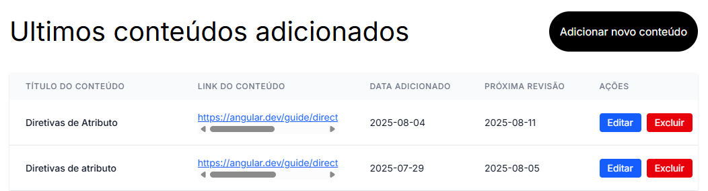
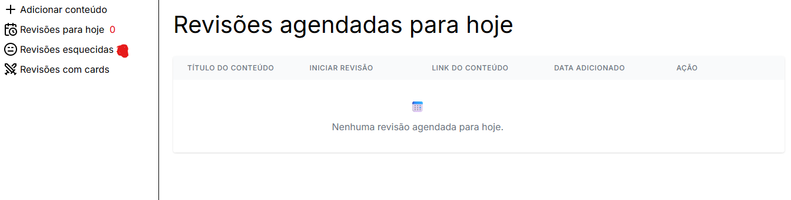

# 📚 Revisa-AI

**Sistema de repetição espaçada para otimizar seus estudos**

O **Revisa-AI** é uma aplicação web desenvolvida para me ajudar nos estudos e fixar melhor o conteúdo através da técnica de **repetição espaçada**. O sistema permite adicionar links de conteúdos e agenda automaticamente revisões em intervalos otimizados: **7, +7 e +14 dias**.

## 🎯 **Por que usar o Revisa-AI?**

- **📅 Repetição Espaçada:** Baseado em estudos científicos, o sistema agenda revisões nos momentos ideais para maximizar a retenção
- **🤖 IA Integrada:** Resumos automáticos gerados pelo Google Gemini (opcional). No código já está pronto a requisição, a única coisa que você precisa passar é sua API KEY. Sinta-se a vontade para comentar o código que faz essa requisição se preferir não usa-la.
- **📱 Interface Intuitiva:** Design moderno e responsivo construído com Angular e Tailwind
- **💾 Dados Locais:** Seus dados ficam seguros em um banco SQLite local
- **🚀 Fácil de Usar:** Basta adicionar um link e o sistema cuida do resto

## ✨ **Funcionalidades**

- ✅ **Adicionar conteúdos** - Criar novos materiais de estudo via link
- ✅ **Editar conteúdos** - Modificar título e link de conteúdos existentes
- ✅ **Excluir conteúdos** - Remover materiais que não são mais necessários
- ✅ **Agendamento automático** - Revisões programadas (7, +7, +14 dias)
- ✅ **Dashboard de revisões** - Visualização das revisões do dia atual
- ✅ **Dados persistentes** - SQLite com backup automático via Docker
- ✅ **Interface responsiva** - Design moderno com TailwindCSS
- ✅ **Arquitetura limpa** - Separação de responsabilidades (MVC + Services)
- ✅ **Cache inteligente** - LocalStorage para melhor performance
- ✅ **Containerização** - Deploy fácil com Docker Compose
- 🔄 **Resumos com IA** - Google Gemini para análise de conteúdo (opcional)

## 🛠️ **Tecnologias Utilizadas**

### **Frontend**

- **Angular 19** - Framework principal com Standalone Components
- **TypeScript** - Linguagem tipada para melhor manutenibilidade
- **TailwindCSS** - Framework CSS utilitário para estilização
- **Angular Services** - Arquitetura de serviços para APIs

### **Backend**

- **Node.js** - Runtime JavaScript
- **Express.js** - Framework web minimalista
- **SQLite** - Banco de dados relacional leve
- **MVC Pattern** - Arquitetura Model-View-Controller
- **Google Gemini API** - IA para resumos automáticos (opcional)

### **DevOps & Ferramentas**

- **Docker** - Containerização da aplicação
- **Docker Compose** - Orquestração de múltiplos containers
- **Nginx** - Servidor web e proxy reverso
- **VS Code** - Configurações de desenvolvimento incluídas

## **🐳 Como usar com Docker (Recomendado)**

### **1. Clone o repositório**

```bash
git clone https://github.com/carloseduardo22-rjce/revisa-ai.git
cd revisa-ai
```

### **2. Suba a aplicação**

```bash
docker-compose up -d
```

### **3. Acesse no navegador**

- **Frontend**: http://localhost
- **API Backend**: http://localhost:3000/api (opcional)

### **4. Dados persistentes**

Os dados ficam salvos em `./server/data/` - mesmo reiniciando o Docker, seus dados permanecem.

### **5. Comandos úteis**

```bash
# Ver logs
docker-compose logs -f

# Parar a aplicação
docker-compose down

# Rebuild completo
docker-compose down && docker-compose up -d --build
```

### **Configure a API do Google Gemini (Opcional)**

- Crie um arquivo `.env` na pasta `server/`
- Adicione sua chave da API:

```env
google_ai_key=SUA_CHAVE_AQUI
```

### **Banco de dados**

O SQLite será criado automaticamente em `server/data/contents.db`

## 📁 **Estrutura do Projeto**

```
revisa-ai/
├── 🌐 Frontend (Angular)
│   ├── src/
│   │   ├── app/
│   │   │   ├── components/        # Componentes da aplicação
│   │   │   │   ├── add-content/   # Adicionar/editar conteúdos
│   │   │   │   ├── layout/        # Layout principal
│   │   │   │   ├── revisoes-hoje/ # Revisões do dia
│   │   │   │   └── sidebar/       # Menu lateral
│   │   │   ├── services/          # Serviços Angular
│   │   │   │   └── content.service.ts
│   │   │   ├── models/            # Interfaces TypeScript
│   │   │   │   └── content.interface.ts
│   │   │   ├── app.routes.ts      # Roteamento
│   │   │   └── app.config.ts      # Configuração
│   │   ├── index.html             # Página principal
│   │   ├── main.ts                # Entry point
│   │   └── styles.css             # Estilos globais
│   ├── package.json               # Dependências frontend
│   ├── angular.json               # Configuração Angular
│   ├── tailwind.config.js         # Configuração TailwindCSS
│   └── tsconfig.json              # Configuração TypeScript
│
├── 🔧 Backend (Node.js)
│   ├── server/
│   │   ├── controllers/           # Lógica dos endpoints
│   │   │   └── content.controller.js
│   │   ├── routes/                # Definição das rotas
│   │   │   └── content.routes.js
│   │   ├── models/                # Modelos de dados
│   │   │   └── content.model.js
│   │   ├── database/              # Configuração do banco
│   │   │   └── db.js
│   │   ├── data/                  # Dados persistentes
│   │   │   └── contents.db        # Banco SQLite
│   │   ├── package.json           # Dependências backend
│   │   ├── index.js               # Entry point
│   │   ├── app.js                 # Configuração Express
│   │   └── Dockerfile             # Container backend
│
├── 🐳 Docker
│   ├── docker-compose.yml         # Orquestração completa
│   ├── Dockerfile                 # Container frontend
│   ├── nginx.conf                 # Configuração Nginx
│   ├── .dockerignore              # Exclusões Docker
│   └── DOCKER.md                  # Instruções Docker
│
├── 📷 Assets
│   └── images-readme/             # Imagens da documentação
│
└── 📋 Configurações
    ├── .vscode/                   # Configurações VS Code
    ├── .gitignore                 # Arquivos ignorados
    └── README.md                  # Esta documentação
```

## 📖 **Como funciona a Repetição Espaçada**

1. **Dia 1:** Você adiciona um conteúdo
2. **Dia 8:** Primeira revisão (7 dias depois)
3. **Dia 15:** Segunda revisão (+7 dias da primeira)
4. **Dia 29:** Terceira revisão (+14 dias da segunda)
5. **Concluído:** Conteúdo fixado na memória de longo prazo mas você pode adicionar mais dias se quiser.

Cada revisão fortalece a memória de longo prazo, garantindo melhor fixação do conteúdo.

## 🤝 **Contribuições**

É um projeto simples de ínicio mas que abre espaço para muitas funcionalidades. Sabendo disso contribuições são sempre bem-vindas! Sinta-se à vontade para:

- Reportar bugs
- Sugerir novas funcionalidades
- Enviar pull requests

## **Imagens do sistema**




## **Estou usando novamente o código que usa a API do gemini**

🚨 Estou usando para gerar as perguntas e respostas dos cards. Você pode melhorar mais o prompt caso queira.

```
const requestBody = {
        contents: [
          {
            parts: [
              {
                text: `Acesse este link: ${link} e gere perguntas e respostas sobre o conteúdo. Quero que você organize as perguntas e respostas separados no padrão "Pergunta: resposta". Não inclua nenhuma outra informação, apenas as perguntas e respostas.`,
              },
            ],
          },
        ],
      };

      const response = await fetch(
        `https://generativelanguage.googleapis.com/v1beta/models/gemini-2.0-flash:generateContent`,
        {
          headers: {
            "Content-Type": "application/json",
            "X-goog-api-key": process.env.google_ai_key,
          },
          method: "POST",
          body: JSON.stringify(requestBody),
        }
      );

      if (!response.ok) {
        const errorText = await response.text();
        console.error("Error response body:", errorText);
        throw new Error(
          `HTTP error! status: ${response.status}, body: ${errorText}`
        );
      }

      const result = await response.json();
      const resumo = result.candidates[0].content.parts[0].text;

      res.json(resumo);
    } catch (error) {
      console.error("Erro ao gerar perguntas e respostas:", error);
      res.status(500).json({ error: "Erro ao gerar perguntas e respostas" });
    }
```
